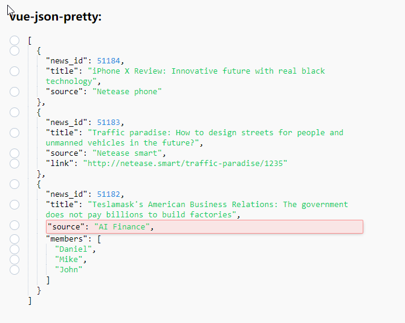

# vue-json-pretty-highlight-row

[](https://travis-ci.org/leezng/vue-json-pretty)
[](https://www.npmjs.org/package/vue-json-pretty)


## 此版本为vue-json-pretty的Fork版本

需求中有日志对比，需要对比新旧数据，所以打算用两个控件来实现

只是为了实现一个高亮的功能，以上

详细用法参考：[https://github.com/leezng/vue-json-pretty](https://github.com/leezng/vue-json-pretty)

## 高亮功能

```vue
<vue-json-pretty
                 ...
                 :highlight-array="highlightArray"
                 ...
                 />
```

```js
data() {
    return {
        ...,
        path: 'res',	//这个节点是根节点，官方Demo有，点击节点会触发
        data:[{
            news_id: 51184,
            title: 'iPhone X Review: Innovative future with real black technology',
            source: 'Netease phone'
        }, {
            news_id: 51183,
            title: 'Traffic paradise: How to design streets for people and unmanned vehicles in the future?',
            source: 'Netease smart',
            link: 'http://netease.smart/traffic-paradise/1235'
        }, {
            news_id: 51182,
            title: 'Teslamask\'s American Business Relations: The government does not pay billions to build factories',
            source: 'AI Finance',
            members: ['Daniel', 'Mike', 'John']
    	}],
		highlightArray: [
          "res[2].source"//这里res，就表示上面的res
        ]
	}
}
```

## 说明

| 属性              | 级别 | 说明         | 类型  | 默认值 |
| ----------------- | ---- | ------------ | ----- | ------ |
| highlight-array ✨ | 高级 | 添加高亮节点 | Array | -      |

## 实际效果


